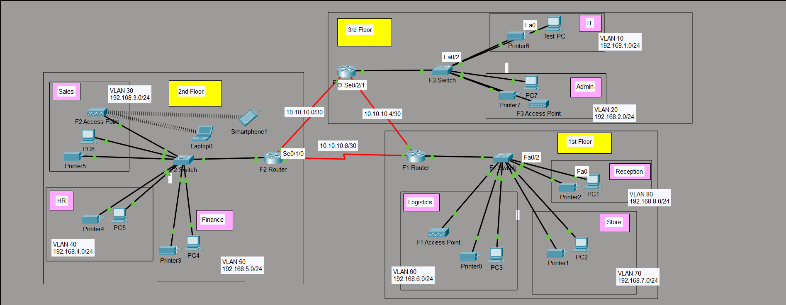

# 🏨 Vic Modern Hotel — Enterprise Network Design & Implementation

> A multi-floor hotel network designed and implemented in **Cisco Packet Tracer**, featuring VLAN segmentation, Router-on-a-Stick inter-VLAN routing, OSPF dynamic routing, DHCP, wireless connectivity, SSH remote management, and switch port security.

---

## 📌 Project Overview

The **Vic Modern Hotel Network** is a three-floor enterprise network designed to provide secure, segmented, and dynamically routed connectivity between hotel departments.

Each floor has its own router and access switch. Departmental networks are separated using VLANs, while the routers communicate through point-to-point serial links running OSPF.

The network was implemented and verified in **Cisco Packet Tracer**.

### Network Goals

- Segment departments using VLANs
- Provide inter-VLAN communication
- Dynamically assign IP addresses using DHCP
- Establish dynamic routing using OSPF
- Provide wireless connectivity for laptops and smartphones
- Enable SSH-based remote router management
- Secure the IT Test-PC switch port using port security
- Provide communication between departments across all three floors
- Verify connectivity and routing using Cisco IOS troubleshooting commands

---

## 🏢 Network Architecture

The hotel consists of **three floors**:

| Floor | Departments | Router | Switch |
|---|---|---|---|
| 1st Floor | Reception, Store, Logistics | F1-Router | F1-Switch |
| 2nd Floor | Finance, HR, Sales/Marketing | F2-Router | F2-Switch |
| 3rd Floor | IT, Admin | F3-Router | F3-Switch |

All three routers are located in the **IT/server-room area** and are interconnected using serial DCE links.

---

## 🌐 Network Topology

The following diagram shows the implemented hotel network, including the three floors, routers, switches, departmental VLANs, wireless access points, end devices, printers, and the dedicated IT Test-PC.




---

# 🔹 VLAN & Department Design

Each department is placed into a separate VLAN and IP network.

| Floor | Department | VLAN | Network | Default Gateway |
|---|---|---:|---|---|
| 1st | Reception | 80 | `192.168.8.0/24` | `192.168.8.1` |
| 1st | Store | 70 | `192.168.7.0/24` | `192.168.7.1` |
| 1st | Logistics | 60 | `192.168.6.0/24` | `192.168.6.1` |
| 2nd | Finance | 50 | `192.168.5.0/24` | `192.168.5.1` |
| 2nd | HR | 40 | `192.168.4.0/24` | `192.168.4.1` |
| 2nd | Sales/Marketing | 30 | `192.168.3.0/24` | `192.168.3.1` |
| 3rd | Admin | 20 | `192.168.2.0/24` | `192.168.2.1` |
| 3rd | IT | 10 | `192.168.1.0/24` | `192.168.1.1` |

### Why VLANs?

VLAN segmentation logically separates departments at Layer 2.

This provides:

- Department-level network separation
- Smaller broadcast domains
- Better network organization
- A scalable foundation for applying security policies
- Controlled communication through Layer 3 routing

---

# 🔹 Inter-VLAN Routing

Inter-VLAN routing is implemented using **Router-on-a-Stick**.

Each floor switch connects to its corresponding router through an **802.1Q trunk**.

The router uses subinterfaces for the departmental VLANs.

### F1-Router

```text
GigabitEthernet0/0.60 → VLAN 60 → 192.168.6.1/24
GigabitEthernet0/0.70 → VLAN 70 → 192.168.7.1/24
GigabitEthernet0/0.80 → VLAN 80 → 192.168.8.1/24
```

### F2-Router

```text
GigabitEthernet0/0.30 → VLAN 30 → 192.168.3.1/24
GigabitEthernet0/0.40 → VLAN 40 → 192.168.4.1/24
GigabitEthernet0/0.50 → VLAN 50 → 192.168.5.1/24
```

### F3-Router

```text
GigabitEthernet0/0.10 → VLAN 10 → 192.168.1.1/24
GigabitEthernet0/0.20 → VLAN 20 → 192.168.2.1/24
```

This allows hosts in different departmental VLANs to communicate through their respective router.

---

# 🔹 Inter-Router Connectivity

The three routers are connected using point-to-point serial networks.

| Network | Purpose |
|---|---|
| `10.10.10.0/30` | Router-to-router link |
| `10.10.10.4/30` | Router-to-router link |
| `10.10.10.8/30` | Router-to-router link |

The implemented router addresses include:

| Router | Serial Address |
|---|---|
| F2-Router | `10.10.10.1/30` |
| F3-Router | `10.10.10.2/30` |
| F3-Router | `10.10.10.6/30` |
| F1-Router | `10.10.10.5/30` |
| F1-Router | `10.10.10.9/30` |
| F2-Router | `10.10.10.10/30` |

The serial links use **DCE clocking** where configured.

---

# 🔹 Dynamic Routing — OSPF

The network uses **OSPF process 10** for dynamic route advertisement.

All participating networks are advertised in **Area 0**.

### OSPF Design


                ┌─────────────┐
                │  F1-Router  │
                │ OSPF Area 0 │
                └──────┬──────┘
                       │
                Serial Network
                       │
                ┌──────┴──────┐
                │  F2-Router  │
                │ OSPF Area 0 │
                └──────┬──────┘
                       │
                Serial Network
                       │
                ┌──────┴──────┐
                │  F3-Router  │
                │ OSPF Area 0 │
                └─────────────┘


### OSPF Verification

OSPF neighbor verification was performed using:

```text
show ip ospf neighbor
```

The routers reported **FULL OSPF adjacencies**.

Examples observed during verification:

```text
F1-Router
192.168.5.1  FULL
192.168.2.1  FULL
```

```text
F2-Router
192.168.8.1  FULL
192.168.2.1  FULL
```

```text
F3-Router
192.168.5.1  FULL
192.168.8.1  FULL
```

The routing tables also showed OSPF-learned departmental networks using the `O` route code.

---

# 🔹 DHCP

Each router acts as a **DHCP server** for the VLANs belonging to its floor.

### F1-Router DHCP Pools

```text
Reception
192.168.8.0/24
Gateway: 192.168.8.1

Store
192.168.7.0/24
Gateway: 192.168.7.1

Logistics
192.168.6.0/24
Gateway: 192.168.6.1
```

### F2-Router DHCP Pools

```text
Finance
192.168.5.0/24
Gateway: 192.168.5.1

HR
192.168.4.0/24
Gateway: 192.168.4.1

Sales
192.168.3.0/24
Gateway: 192.168.3.1
```

### F3-Router DHCP Pools

```text
IT
192.168.1.0/24
Gateway: 192.168.1.1

Admin
192.168.2.0/24
Gateway: 192.168.2.1
```

DHCP operation was verified using:

```text
show ip dhcp binding
show ip dhcp pool
```

Active DHCP bindings were observed on the three routers during testing.

---

# 🔹 Wireless Network

Wireless access points are deployed on the hotel floors to provide connectivity for wireless end devices such as:

- Laptops
- Smartphones

The wireless networks are integrated into the floor-level network design and are represented in the Packet Tracer topology.

---

# 🔹 SSH Remote Management

SSH was configured on all three routers for remote administrative access.

The routers use:

```text
ip domain-name
username
line vty
login local
transport input ssh
```

The VTY lines are configured to accept **SSH rather than Telnet**.

### Verification

The dedicated **Test-PC** in the IT department was used to test remote router login.

The Test-PC is connected to:

```text
F3-Switch
FastEthernet0/2
```

This provides a practical test point for remote network administration.

> Credentials are intentionally not included in this public repository.

---

# 🔐 Switch Port Security

Port security is configured on the IT department switch.

### Protected Port

```text
F3-Switch
FastEthernet0/2
```

### Security Requirements

| Setting | Configuration |
|---|---|
| Port | `Fa0/2` |
| Mode | Access |
| VLAN | `10` |
| Port Security | Enabled |
| Maximum Secure MACs | `1` |
| MAC Learning | Sticky |
| Violation Mode | Shutdown |
| Authorized Device | Test-PC |

The sticky MAC address learned for the Test-PC was verified in the switch configuration and MAC address table.

### Verification

```text
show port-security
show port-security interface fa0/2
show mac address-table
```

Observed status:

```text
Port Security              : Enabled
Port Status                : Secure-up
Violation Mode             : Shutdown
Maximum MAC Addresses      : 1
Sticky MAC Addresses       : 1
Security Violation Count  : 0
```

This demonstrates a basic Layer 2 access-control mechanism that prevents an unauthorized device from using the protected port.

---

# 🧪 Network Testing & Verification

The network was tested using Cisco IOS verification commands and end-to-end ICMP connectivity tests.

### Router Verification Commands

```text
show ip interface brief
show ip ospf neighbor
show ip protocols
show ip route
show ip dhcp binding
show ip dhcp pool
```

### Switch Verification Commands

```text
show vlan brief
show interfaces trunk
show mac address-table
show port-security
show port-security interface fa0/2
```

### Connectivity Tests

Successful ICMP connectivity was observed from the testing PC to devices in different networks, including:

```text
192.168.4.2
192.168.8.2
192.168.2.2
```

The captured tests showed:

```text
Packets: Sent = 4, Received = 4, Lost = 0
```

for each of the supplied connectivity tests.

This confirms successful reachability across multiple VLANs and floors in the tested paths.

---

# 📊 Verification Summary

| Component | Verification | Result |
|---|---|---|
| VLAN segmentation | `show vlan brief` | ✅ Verified |
| 802.1Q trunking | `show interfaces trunk` | ✅ Verified |
| Router subinterfaces | `show ip interface brief` | ✅ Verified |
| OSPF neighbors | `show ip ospf neighbor` | ✅ FULL |
| OSPF routes | `show ip route` | ✅ Verified |
| DHCP pools | `show ip dhcp pool` | ✅ Verified |
| DHCP leases | `show ip dhcp binding` | ✅ Observed |
| SSH configuration | `show running-config` | ✅ Configured |
| Test-PC | F3-Switch `Fa0/2` | ✅ Configured |
| Port Security | `show port-security interface fa0/2` | ✅ Verified |
| Sticky MAC | Port Security output | ✅ Verified |
| ICMP connectivity | Ping tests | ✅ 0% packet loss |

---

# 🛠️ Technologies & Skills Demonstrated

This project demonstrates practical networking skills in:

### Cisco Networking

- Cisco IOS CLI
- Cisco Packet Tracer
- Router configuration
- Switch configuration
- Interface configuration
- Serial DCE connectivity

### Layer 2 Networking

- VLAN creation
- Access ports
- 802.1Q trunking
- MAC address table verification
- Port security
- Sticky MAC learning
- Shutdown violation mode

### Layer 3 Networking

- IPv4 addressing
- Subnetting
- Router-on-a-Stick
- Inter-VLAN routing
- OSPF
- Dynamic route advertisement

### Network Services

- DHCP server configuration
- DHCP address allocation
- DNS server option configuration
- SSH remote management

### Troubleshooting & Verification

- `show` command analysis
- OSPF neighbor verification
- Routing table analysis
- DHCP binding verification
- VLAN/trunk verification
- MAC address verification
- End-to-end ping testing

---

## 📁 Repository Structure

```text
vic-modern-hotel-network/
│
├── 📄 README.md
│
├── 📁 packet-tracer/
│   └── 📄 Vic-Modern-Hotel.pkt
│
├── 📁 topology/
│   └── 🖼️ vic-modern-hotel-topology.png
│
├── 📁 addressing/
│   ├── 📄 vlan-table.md
│   ├── 📄 ip-addressing-table.md
│   └── 📄 router-serial-links.md
│
├── 📁 configurations/
│   ├── 📁 routers/
│   │   ├── 📄 F1-Router-config.txt
│   │   ├── 📄 F2-Router-config.txt
│   │   └── 📄 F3-Router-config.txt
│   │
│   └── 📁 switches/
│       ├── 📄 F1-Switch-config.txt
│       ├── 📄 F2-Switch-config.txt
│       └── 📄 F3-Switch-config.txt
│
├── 📁 documentation/
│   ├── 📄 01-project-overview.md
│   ├── 📄 02-network-topology.md
│   ├── 📄 03-vlan-configuration.md
│   ├── 📄 04-ip-addressing.md
│   ├── 📄 05-inter-vlan-routing.md
│   ├── 📄 06-ospf-routing.md
│   ├── 📄 07-dhcp-configuration.md
│   ├── 📄 08-wireless-network.md
│   ├── 📄 09-ssh-configuration.md
│   ├── 📄 10-port-security.md
│   └── 📄 11-network-testing.md
│
├── 📁 screenshots/
│   ├── 🖼️ 01-final-topology.png
│   ├── 🖼️ 02-f1-vlans.png
│   ├── 🖼️ 03-f2-vlans.png
│   ├── 🖼️ 04-f3-vlans.png
│   ├── 🖼️ 05-f1-trunk.png
│   ├── 🖼️ 06-f2-trunk.png
│   ├── 🖼️ 07-f3-trunk.png
│   ├── 🖼️ 08-f1-ospf-neighbors.png
│   ├── 🖼️ 09-f2-ospf-neighbors.png
│   ├── 🖼️ 10-f3-ospf-neighbors.png
│   ├── 🖼️ 11-f1-routing-table.png
│   ├── 🖼️ 12-f2-routing-table.png
│   ├── 🖼️ 13-f3-routing-table.png
│   ├── 🖼️ 14-f1-dhcp.png
│   ├── 🖼️ 15-f2-dhcp.png
│   ├── 🖼️ 16-f3-dhcp.png
│   ├── 🖼️ 17-test-pc-ssh.png
│   ├── 🖼️ 18-port-security-summary.png
│   ├── 🖼️ 19-fa0-2-port-security.png
│   ├── 🖼️ 20-test-pc-sticky-mac.png
│   └── 🖼️ 21-cross-vlan-connectivity.png
│
└── 📁 results/
    ├── 📄 connectivity-tests.md
    └── 📄 verification-results.md
---

# 🎯 Key Learning Outcomes

Through this implementation, the project demonstrates an understanding of how multiple networking concepts work together in an enterprise-style environment.

The main learning outcomes include:

- Designing a multi-floor enterprise network
- Planning VLANs and IP addressing
- Implementing Router-on-a-Stick
- Establishing OSPF neighbor relationships
- Understanding dynamically learned routes
- Configuring router-based DHCP services
- Implementing SSH for remote administration
- Applying switch port security
- Using sticky MAC learning
- Performing structured network verification
- Troubleshooting connectivity using Cisco IOS commands

---

# 👨‍💻 Project Focus

**Project:** Vic Modern Hotel Network  
**Platform:** Cisco Packet Tracer  
**Network Type:** Multi-floor enterprise LAN  
**Routing Protocol:** OSPF  
**Inter-VLAN Routing:** Router-on-a-Stick  
**Address Allocation:** DHCP  
**Remote Management:** SSH  
**Layer 2 Security:** Port Security + Sticky MAC  
**Testing:** ICMP / Cisco IOS verification commands

---
## 👨‍💻 Author

### Shaikh Sufiyan

Networking enthusiast focused on practical Cisco networking, network design, and troubleshooting.

**Skills demonstrated:** VLANs · Inter-VLAN Routing · OSPF · DHCP · SSH · Port Security

### Connect

- **GitHub:** [shaikh-sufiyan-3](https://github.com/shaikh-sufiyan-3)
- **LinkedIn:** [Shaikh Sufiyan](https://www.linkedin.com/in/shaikh-sufiyan-aab51a3b1/)
- **Email:** shaikh.sufiyan.sec@gmail.com
---
## 📌 Note

This repository documents the network as implemented and verified in Cisco Packet Tracer. Configuration details and verification results are based on the implemented lab environment rather than a production deployment.

---
